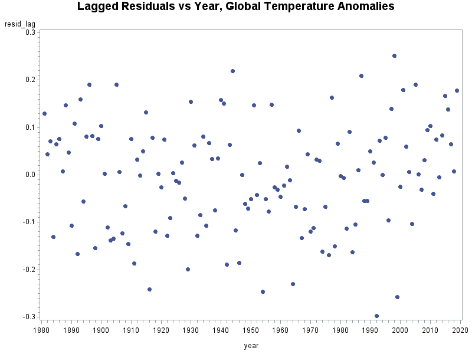

\subsection{Question 1}

I acknowledge the homework expectation set forth by the instructor in conjunction with the honor code for the Colorado School of Public Health.

```{r setup, echo = FALSE, include = FALSE, warning = FALSE}
library(ggplot2)

data = read.csv("../data/cholesterol.csv")

```

\subsection{Question 2}

```{r part_a, echo=FALSE, include=FALSE}
# part a
model0 = lm((after - before) ~ 1, data = data)
summary(model0)
AIC(model0)


```
### Part A

After a linear regression where the outcome was change in cholesterol level (mcg/dl), it was determined that the average difference between post- and pre-cholesterol level was significant (p = `r round(summary(model0)$coefficients[4], 6)`). The cholesterol level (mcg/dl) was 19.54 (mcg/dl) lower on average for the 24 hospital employees who switched from the standard American diet to a vegetarian diet for one month.

```{r, part_b, echo=FALSE, include=FALSE}
# part b
result_t = t.test(data$before, data$after, paired = T)

```

### Part B

The simple test (see appendix) that could be performed to yield the same result as the previous is a paired $t$-test to detect differences between the two time points ($t$ = `r result_t$statistic`).

```{r, part_c, echo=FALSE, include=FALSE}
# part c
model1 = lm(after ~ before, data = data)
summary(model1)
AIC(model1)

```

### Part C

After a linear regression where the outcome was pre- cholesterol level (mcg/dl), it was determined that the average post- cholesterol level was significant in the model of pre- cholesterol (mcg/dl) (p = `r round(summary(model1)$coefficients[2, 4], 8)`). For a one mcg/dl increase in cholesterol before the start of the vegetarian diet, there was a corresponding increase of `r round(summary(model1)$coefficients[2, 1], 3)` mcg/dl in cholesterol after the conclusion of the vegetarian diet in 24 hospital employees.


```{r part_d, echo=FALSE, include=TRUE, warning=FALSE}
# part d
aov = anova(model1, model0)

ggplot(data, aes(x = model0$residuals, y = data$before)) +
  geom_point() +
  geom_hline(yintercept = mean(data$before)) +
  labs(
    x = "Residuals",
    y = "Pre- Cholesterol Level (mcg/dl)",
    title = "Residual plot for pre- cholesterol level (Change score model)"
  )

ggplot(data, aes(x = model1$residuals, y = data$before)) +
  geom_point() +
  geom_hline(yintercept = mean(data$before)) +
  labs(
    x = "Residuals",
    y = "Pre- Cholesterol Level (mcg/dl)",
    title = "Residual plot for pre- cholesterol level (Baseline-as-covariate model)"
  )
```

### Part D

The change score model is very easy to convey interpretations (just as a simple t-test is). However, the baseline-as-covariate model does seem to have normally distributed residuals, suggesting maybe it is fitting the data a bit better. Additionally, the AIC value for the baseline-as-covariate model was significantly lower than the change-score model (`r AIC(model1)` < `r `AIC(model0)`). The interpretation for the baseline-as-covariate model is slightly more complex. We are interpreting the baseline cholesterol level using the post cholesterol value as a predictor.

### Part E

```{r part_e, echo=FALSE, include=FALSE}
# part e
model2 = lm((after - before) ~ before, data = data)
summary(model2)

```

$$y_{i2} - y_{i1} = \beta_{intercept} + \beta_{after}x_{i2} + \epsilon_i$$
$$y_{i2}= \beta_{intercept} + \beta_{after}x_{i2} + \epsilon_i + y_{i1}$$
The differnece between the hybrid and the baseline-as-covariate model is the addition of the baseline cholesterol level on the right side of the equation. This should shift the intercept of the equation for each patient (the difference from a random intercept here is we are not estimating the random intercept term, rather we are providing it, the random intercept is the baseline cholesterol value). This seems to result in a more conservative model (lower estimate for the coefficient estimating the slope, and a larger p-value). It seems to me that we are not allowing for the baseline cholesterol to account for as much variation in the hybrid model than as in the baseline as covariate model.

$$H_0: \hat{\beta'_1} = 0, H_1: \hat{\beta'_1} \neq 0$$

### Part F

```{r, echo=FALSE, include=FALSE}
# load the SASmarkdown package
library(SASmarkdown)
# set up the options so that knit knows where you SAS executable is
# set the linesize to be easily readable on letter size paper, portrait
# and set the knir options using opts_chunk$set().
saspath <- "C:/Program Files/SASHome/SASFoundation/9.4/sas.exe"
sasopts <- "-nosplash -linesize 75"
knitr::opts_chunk$set(engine="sas", engine.path=saspath,
        engine.opts=sasopts, comment=NA)
# run these commands to convince yourself that
# within this knitr session the engine changed.
knitr::opts_chunk$get()$engine
knitr::opts_chunk$get()$engine.path
knitr::opts_chunk$get()$engine.opts
```

```{sas question2, echo=FALSE, include=FALSE}

/* Question 2 */
/* Import data */
proc import datafile = 'C:\Users\jofro\dev\longi\data\cholesterol.csv'
 out = data1
 dbms = CSV;
run;

/* add subject variable to data */
data wide;
 set data1;
 subject+1;
run;

/*
	transpose data by subject:
	'let' transposes only the last observation for each 'by' group
	rename _name_ and col1
*/
proc transpose data=wide out=long (rename=(_name_=time col1=cholesterol)) let;
 by subject;
run;

/* linear mixed model with unstructured covariance */
proc mixed data = long method = ml;
 class time;
 model cholesterol = time / solution;
 repeated / type=UN;
run;

```
Using unstructured covariance for the mixed model containing repeated measures yielded similar results to the Hybrid model in terms of statistical results. However, it did indeed yield a smaller standard error for the intercept estimate. It seems to me that in general the mixed model approach is a more robust modeling technique, however, in this specific scenario we do seem to be over complicating a simple problem. If we go all the way back to the mention of a $t$-test, we have carried the same result throughout the analysis, that cholesterol level was affected by the vegetarian diet. Nothing about the 4 models that followed provided any new clinical information. In general, unless there is some mathematical reason to use a more robust model (in the case of several repeated measures for example), we should stand by the simple, easy to interpret, and easy to convey model.

\subsection{Question 3}

a. Determine $E[\epsilon_t]$

$$E[\epsilon_t] = E\left[\sum_{j=0}^{\infty}\phi^jZ_{t-j}\right]$$
$$E[\epsilon_t] = \sum_{j=0}^{\infty}\phi^jE\left[Z_{t-j}\right]$$
$$E[\epsilon_t] = \sum_{j=0}^{\infty}\phi^j\left(0\right)$$
$$E[\epsilon_t] = 0$$
b. determine $Cov[\epsilon_t, \epsilon_{t+h}]$
$$Cov[\epsilon_t, \epsilon_{t+h}] = E[\epsilon_t\epsilon_{t+h}] - E[\epsilon_t]E[\epsilon_{t+h}]$$
$$Cov[\epsilon_t, \epsilon_{t+h}] = E[\epsilon_t\epsilon_{t+h}]$$
$$Cov[\epsilon_t, \epsilon_{t+h}] = E\left[\left(\sum_{j=0}^{\infty}\phi^jZ_{t-j}\right)\left(\sum_{k=0}^{\infty}\phi^kZ_{t+h-k} \right)\right]$$
$$Cov[\epsilon_t, \epsilon_{t+h}] = \sum_{j=0}^{\infty}\sum_{k=0}^{\infty}\phi^j\phi^kE[Z_{t-j}Z_{t+h-k}]$$
for $r\neq s$, $E[Z_rZ_s] = E[Z_r]E[Z_s]=0$
for $r\neq s$, $E[Z_rZ_s] = Var[Z_r]E[Z_r^2]=\sigma_z^2$
$$Cov[\epsilon_t, \epsilon_{t+h}] = \sigma_z^2\sum_{j=0}^\infty\phi^j\phi^{j+h}$$
$$Cov[\epsilon_t, \epsilon_{t+h}] = \sigma_z^2\phi^h\sum_{j=0}^\infty(\phi^{j})^2$$
$$\forall\:|\phi|\geq 1, Cov[\epsilon_t, \epsilon_{t+h}]\to\infty$$
$$\forall\:|\phi|<1, Cov[\epsilon_t,\;\epsilon_{t+h}] = \frac{\sigma_z^2\phi^h}{1-\phi^2}$$
c. determine $Corr[\epsilon_t, \epsilon_{t+h}]$
$$\rho_h = Corr[\epsilon_t, \epsilon_{t+h}]$$
$$\rho_h = \frac{\gamma_h}{\gamma_0}$$
$$\rho_h = \frac{\frac{\sigma_z^2\phi^h}{1-\phi^2}}{\frac{\sigma_z^2}{1-\phi^2}}$$
$$\rho_h = \phi^{|h|}$$
d. is $\{\epsilon_t\}$ a stationary process?
  
This process is mostly stationary. When $|\phi| < 1$, the mean and variance are finite and constant, and the autocorrelation only depends on $h$.

\subsection{Question 4}

```{sas question4, echo=FALSE, include=FALSE}
/* Question 4 */
/* import data */
proc import datafile = 'C:\Users\jofro\dev\longi\data\global_temp_anomalies.csv'
 out = data2
 dbms = CSV;
run;

/* mixed model with AR(1) structure */
proc mixed data = data2 method=ml plots=all;
 model temp=year / solution outp=tempout;
 repeated / type=AR(1) subject=intercept;
run;

/* plot the residulas vs time */
symbol1 v=dot i=none;
proc gplot data=tempout;
 plot resid*year;
 title 'Residuals vs Year, Global Temperature Anomalies';
run;

/* transform the residuals */
data lag;
 set tempout;
 resid_lag = Resid + lag1(Resid)*0.7395;
run;

/* plot the transformed residuals */
symbol1 v=dot i=none;
proc gplot data=lag;
 plot resid_lag*year;
 title 'Lagged Residuals vs Year, Global Temperature Anomalies';
run;

/* transform the year variable to quadratic and cubic terms */
data poly;
 set data2;
 year_sq = year*year;
 year_cu = year*year*year;
run;

/* cubic mixed model */
proc mixed data=poly method=ml plots=all;
 model temp=year year_sq year_cu / solution outp=tempout;
 repeated / type=AR(1) subject=intercept;
run;

/* non-parametric model */
proc loess data=data2;
 ods output scoreresults=scoreout
 	 outputstatistics=statout;
 model temp = year / smooth= 0.3 residual clm degree=1;
 score data=tempout / clm;
run;

/* plot residuals from non-parametric model */
symbol1 v=dot i=none;
proc gplot data=scoreout;
 plot resid*year;
 title 'Loess Residuals vs Year, Global Temperature Anomalies';
run;
 	 
```

### Part A


The residuals do not have constant variance over time. It seems as though our assumption $\epsilon_i \sim N(0, \sigma)$ is violated in this model. A linear model does not seem to be fitting the data as well as it could be.  

### Part B


After accounting for correlation between time points, it seems as though there is a little better spread about the data. This is reasonoable, because we are scaling the residuals based on their previous time point, so those points close to 0 would still be close to 0 and those farther away from 0 would scale even farther from zero. So this plot should have the same shape as the previous, with larger variability. That being said, we are certainly still violating the constant variance assumption (homoscedascisity), there likely is a better model out there to fit these data (probably a non-linear approach).

### Part C

Based on the model fitted above, the average increase in temperature per decade is 0.07 degrees (0.007 per year x 10).

### Part D

Based on looking at the plot, I chose a cubic function to model the time trend. The model fit in terms of information criterion is much better for the cubic function than it is for the linear time trend (>6 difference for AIC and BIC). Furthermore, the estimate for the correlation parameter has decreased from 0.72 to 0.47. This seems resonable because we are allowing for a more flesible model to explain changes between time points. This seems like a fairly good fit for this model. It terms of fit alone I would cetainly choose the cubic time trend model over the linear time trend model, it is explaining the variability in the data much better than the linear model. That being said, the cubic trend is extremely difficult to interpret, and would have to put more thought into interpretting that model.

### Part E


In general this seems to be a much better fit. The Errors are certainly more normally distributed that either the linear model or the polynomial model. This is also a different fit, and I don't know if we compare information criterion between parametric and non-parametric models. There is an obvious non-linear trend over time, and the non-parametric seems to be modeling this non-linear trend much better based on the residuals.