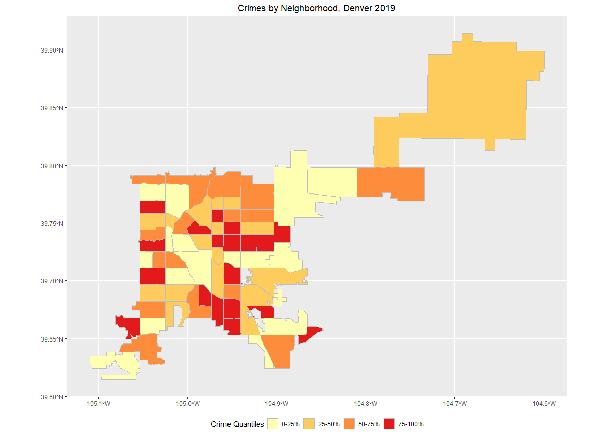

\section{Data}

The data are publicly available crimes data published by the city of Denver.$^1$ The data contain information including location, time stamp, and crime category. All of this information will be useful for this analysis. The city of Denver also provides the GIS shapefile of the city of Denver to be used for map making.$^1$ In addition to the crime data provided by the city of Denver, I am also using population information from the 2010 census.$^2$ Census data stratified by neighborhood in the Denver area are not available yet. This is a possible limitation of this study.

\section{Questions}

1. How are crimes distributed by neighborhood in denver?

2. How is crime correlated between Denver neighborhoods?

3. How is crime correlated within Denver Neighborhoods?

\section{Correlation}

The most obvious correlation in this data is the correlation of the number of crimes between neighborhoods (Figure 1). The data may also be correlated by population (higher crime rates in areas of higher population). And lastly, the data will may be correlated by crime category, within neighborhood.

This data is interesting because of the spatial nature of crimes being committed. Crimes are committed frequently for specific reasons, and this may be related to the location of the crime itself. Because of the implication of including race and/or ethnicity in a study like this, I will not be including this in the analysis (I am not qualified to discuss the meaning of a significant result related to race and/or ethnicity). But it should be noted that neighborhoods in Denver County are segregated to this day.

Crime data is always messy due to issues with crime reporting. Law enforcement are not necessarily reliable with recording procedures. The data also are censored before the public are able to obtain the data, certain crimes like sexual assault and rape are sometimes censored for obvious privacy implications for both victims and alleged perpetrators. There is also some missingess, where either a time stamp or a location of the crime was not reported, and thus steps will have to be taked to deal with this missingness.
\newpage

\newpage
\section{References}

1. https://www.denvergov.org/opendata/dataset/city-and-county-of-denver-crime

2. https://www.denvergov.org/opendata/dataset/city-and-county-of-denver-census-neighborhood-demographics-2010
