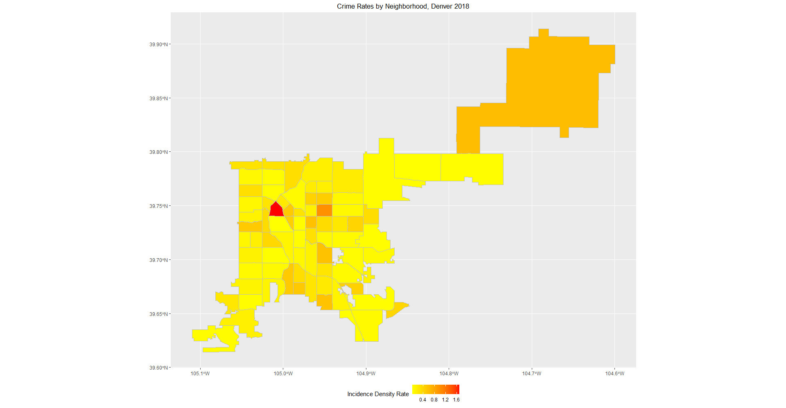

```{r analysis, echo=FALSE, include=TRUE}
library(geepack)
library(lme4)
library(nlme)
library(nnet)
library(reshape2)
library(tidyr)

data = read.delim("../data_raw/denver.txt")
denver = read.delim("../data_raw/denver_boundary.txt")
colnames(denver) = c("nbhd_id", "nbhd_name", "count", "pop", "rate", "above_median")

log_reg = glmer(cbind(is_crime, is_traffic) ~ (1 | neighborhood_id), family = binomial(link = "logit"),  data=data)
summary(log_reg)
ranef(log_reg)

```

\newpage


\newpage


\newpage
\section{References}

1. https://www.denvergov.org/opendata/dataset/city-and-county-of-denver-crime

2. https://www.denvergov.org/opendata/dataset/city-and-county-of-denver-census-neighborhood-demographics-2010
