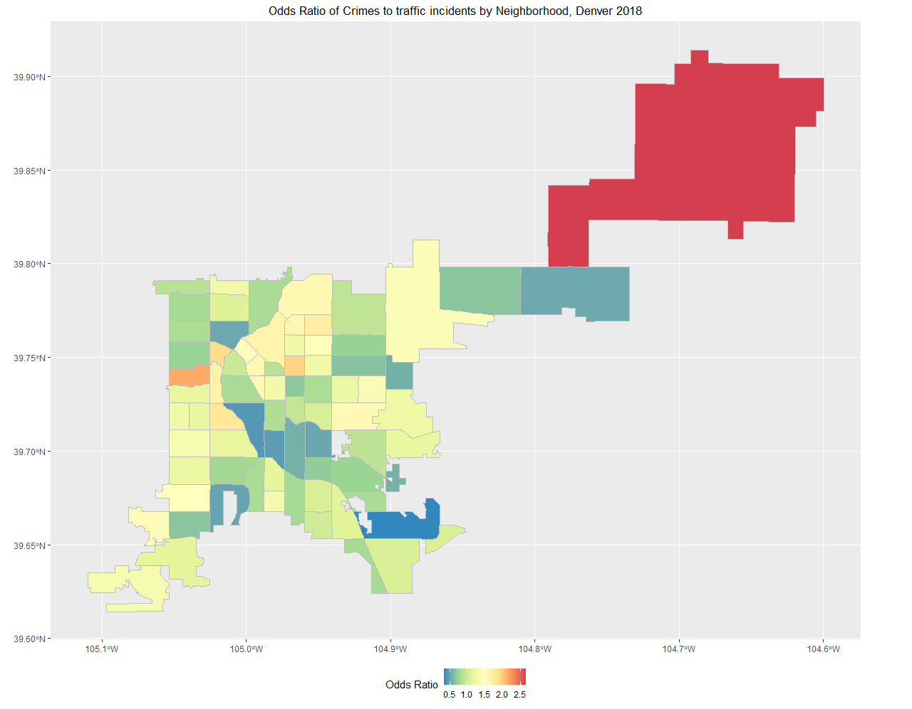

\newpage
\section{Preliminary Analysis, Aim 1}

Aim 1: What is the role of neighborhoods on type of crime committed?

As part of the exploratory analysis, 

The initial analysis was ammended slightly from the previous project update. The goal of my first statistical analysis was to compare the types of crimes commited in each neighborhood. The data contain a variable that differentiates between traditional crimes and traffic violations (for our intents and purposes and indication of violent and non-violent crime). This variable was used to constuct a generalized linear mixed model (using `lmer()`) using a logit link for the odds of crimes to traffic violations, and also applying random effects for neighborhood in Denver. Additionally, because crimes and population are known to be related (regardless of its significance in this analysis) we are adjusting for the population. So the results shown in \textit{figure 3} are the odds ratio of crimes to traffic violations in each neighborhood in Denver, adjusted for the population. The odds ratios are gathered by exponentiating the random effects from the logistic regression model shown below.

$$log(Y_{ij}) = \beta_0 + \beta_{pop}x_i + b_j$$
$$Y_{ij}=\Big(\frac{p}{1-p}\Big):\; \text{are the odds of crime over traffic violation}$$
$$p: \text{is the probability of a crime}$$
$$(1-p): \text{is the probability of a traffic incident}$$
$$i = 1, ..., m \\$$
$$m: \text{is the number of crimes} \\$$
$$j = 1, ..., n \\$$
$$n: \text{is the number of neighborhoods}$$

\begin{verbatim}
log_reg = glmer(
  cbind(is_crime, is_traffic) ~ log10(pop) + (1 | neighborhood_id),
  family = binomial(link = "logit"),
  data=data
)
\end{verbatim}

A few notes from the information above. Populations are not normally distributed, nor are they on a usable scale that is condusive for convergence using the package `lme4`, hence the $log_{10}(population)$ is used for this analysis. Convergence criteria per the package defaults were not met for this model, however the gradient value and metric criteria are small enough. The convergence criteria is a tolerance of `0.002` and the largest gradient was `0.00478` (not a large enough gradient to cause concern, if I were to code this problem with normal gradient descent I would set the tolerance much higher).

\section{Analysis Plan, Aim 2}

Aim 2: What is the effect of time on crimes in neighborhoods in denver?

To address this model, I plan to build a linear mixed effects model that predicts crime incidence density rates while adjusting for month and neighborhood. I will use a spatial correlation structure where months that are closer together are more highly correlated than those farther apart. I will fit this model in SAS, exploring random effects for month and neighborhood.

\newpage
\section{Tables and Figures}

\newpage

\newpage

\newpage
\section{References}

1. https://www.denvergov.org/opendata/dataset/city-and-county-of-denver-crime

2. https://www.denvergov.org/opendata/dataset/city-and-county-of-denver-census-neighborhood-demographics-2010
