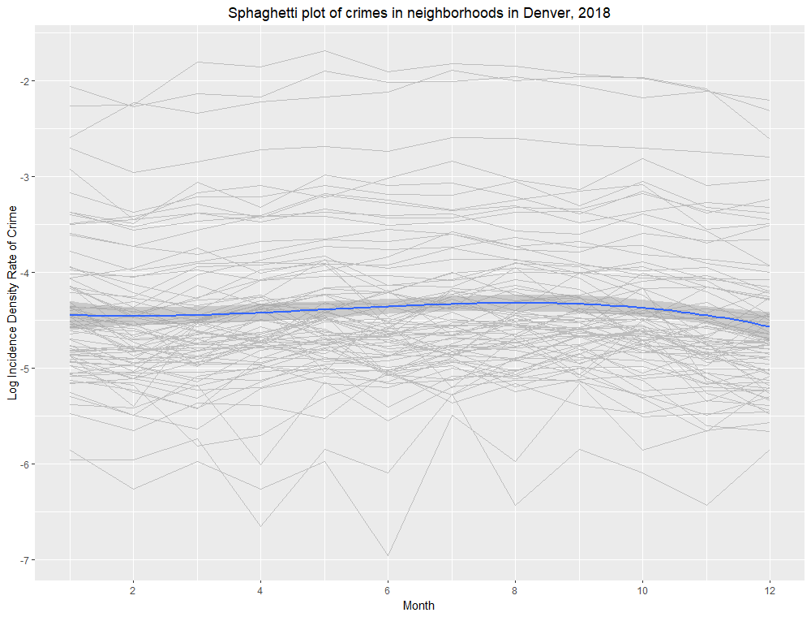

\twocolumn
\section{Introduction}

The influx of publicly available data and improvements in software over the last twenty years has made it possible to do many more analyses on urban data, including but no limited to, traffic, environmental, crime, and demographic data. When moving to a new neighborhood or a new city, many people may consider things like pollution, crime, real estate values, etc. When policy makers propose new laws they may also need to take advantage of these new modeling and visualization tools. There are many sophisticated ways to model spatial data, however for the purposes of this analysis, we will be using linear mixed effects models, with spatial random effects to analyze spatial crime data in Denver County, Colorado. There are two goals for this analysis, determine the role of neighborhoods on type of crime committed, and to determine the effect of time on crimes in neighborhoods in Denver.

\section{Methods}
\subsection{Data}

The data consists of $N=93,391$ crimes documented by the Denver County Police department in the year 2018. The data include information about the location (neighborhood), a variable that indicates whether a crime was a traffic crime, and a time stamp for each crime. We also used census data from 2010 to extract population data in each neighborhood in Denver County, and lastly, the Denver County neighborhood geometries for map making.

The data and county geometries for map making are publicly available from the County of Denver$^{1,2,3}$.

\subsection{Statistical Modeling}

The goal of the first statistical analysis is to compare the types of crimes committed in each neighborhood. The data contain a variable that differentiates between traditional crimes and traffic violations (for our intents and purposes and indication of violent and non-violent crime). To achieve the first goal of comparing types of crimes commited in each neighborhood, a generalized linear mixed model using a logit link for the odds of crimes to traffic violations, and also applying random intercepts for neighborhood in Denver. Additionally, because crimes and population are known to be related (regardless of its significance in this analysis) we are adjusting for the population.

\begin{equation}\label{eq}
  log(y_{ij}) = \beta_0 + \beta_{pop}x_i + b_j
\end{equation}
$$b_j \sim \mathcal{N}(0, \textbf{G})$$
$$\textbf{G} : \text{Unstructured}$$

The goal of the second analysis was to determine the effect of time on crime incidence density rates. This will be done with a linear mixed effects model that predicts crime incidence density rates while adjusting for month (continuous) and neighborhood (categorical). Incidence density rate of crimes are shown in figures below (see Figures 1 & 2). Incidence density rates was $log$ transformed due to lack of normality in the data. Three models with higher order terms for month (linear, quadratic, and cubic) will be compared, with two covariance structures (first-order auto-regressive [AR(1)], and heterogeneous compound symmetry[CSH]) that allow months that are closer together to be more highly correlated than those farther apart. This will results in a model comparison of six different models.

Linear:
\begin{equation}\label{eq}
  y_{ij} = \beta_0 + \beta_{t1}x_i + b_j + \epsilon_{ij}
\end{equation}
Quadratic:
\begin{equation}\label{eq}
  y_{ij} = \beta_0 + \beta_{t1}x_i+ \beta_{t2}x_i^2 + b_j + \epsilon_{ij}
\end{equation}
Cubic:
\begin{equation}\label{eq}
  y_{ij} = \beta_0 + \beta_{t1}x_i+ \beta_{t2}x_i^2 + \beta_{t3}x_i^3 + b_j + \epsilon_{ij}
\end{equation}
$$b_j \sim \mathcal{N}(0, \textbf{G})$$
$$\textbf{G} : \text{Unstructured}$$
$$\epsilon_{ij} \sim \mathcal{N}(0, \text{R})$$
$$\text{R} : \text{AR(1), or Heterogeneous-CS}\: (CSH)$$

The statistical modeling framework is outlined in the supplementary statistical methods.

All analyses were fit in `R 4.1.2`, using the function`lmer` from `lme4` package, or `SAS 9.4` using the `mixed` procedure (see Appendix).

\section{Results}

The first analysis comparing the probability of different types of crime reveals that odds of traffic crime are higher in high vehicle traffic areas. The results of the generalized linear mixed effects model are shown in \textit{figure 3}. Displayed within the map are the odds ratio of crimes to traffic violations in each neighborhood in Denver, adjusted for the population. The odds ratios are gathered by exponentiating the random effects from the logistic regression model. The odds of a non-traffic crime are highest at the Denver International Airport. The odds of traffic crime are highest in in the Hampden neighborhood. There is also a visual trend of higher odds of traffic crimes along the I-25 and I-70 corridors (I-70 neighborhoods with high traffic crime: Globeville, Elyria-Swansea, Montbello, Green Valley Ranch; I-25 neighborhoods with high traffic crime: Globeville, Highland, Lincoln Park, Baker, Washington Park West, Washington Park, Cory-Merrill, Hampden, and Southmoor Park).

The second analysis comparing the incidence density rates of crime for each month in each neighborhood in Denver, yielded a significant cubic, quadratic, and linear time trend for crime in Denver.The results of the linear mixed effects model comparison are provided in \textit{figures 4} and \textit{5}. Convergence criteria per the package defaults were not met for this model, however the gradient value and metric criteria are small enough. The convergence criteria is a tolerance of `0.002` and the largest gradient was `0.00478` (not a large enough gradient to cause concern, if I were to code this problem with normal gradient descent I would set the tolerance higher). The linear time trend was not significant when modeled with no higher-order time trends. However, in both the second degree and third degree polynomial models, the linear time trend was statistically significant, in addition to all higher order time trends.

Modeling the repeated measures using CSH yielded a lower AIC than those using AR(1) for both models with higher order time trends, evidence that CSH models the repeated measures error structure is modeled better by CSH than AR(1). It should be noted that using CSH error structure for the repeated time measurements results in the introduction of more parameters, and thus the BIC is noticeably higher for these models. 

\section{Conclusion}
\subsection{Discussion}

The results of exploratory analysis tell us that the incidence rate is highest in Auraria (downtown), and this is likely due to high crime and low static population in downtown Denver. And crime incidence rate is lowest in Montbello, likely due to it being mostly residential and a high income neighborhood.

The results of the first analysis, which was the logistic mixed effects regression model tell us that the odds of traffic crimes are higher in general, in neighborhoods that have an interstate running through them. Lower income neighborhoods like Jefferson Park, Sun Valley, West Colfax, and Valverde tend to have higher odds of non-traffic crime. There is also much higher odds of non-traffic crimes at DIA, which would indicate that airport crimes are quite common. This may also be a result of a very low static population in the DIA neighborhood, and few numbers of roads.

The results of the second analysis, which was the linear mixed effects regression model tell us that crime incidence in significantly associated with higher order time trends. This is evidence that crime is not only significantly different over time, but also that crime is non-linear over time. Crime fluctuates throughout out the year, and this indicates that further analysis should investigate why crime fluctuates over time. The linear mixed effects regression model comparison of covariance structures also tells us that there is some sort of serial correlation between time points.

\subsection{Limitations}

There are several limitations to this study that are outlined briefly here. Firstly, crimes are committed by mostly moving populations, census data reflects static data. Secondly, the census data was from 2010 (2020 census data is not available yet), and the crime data is from 2018, which may result in some measurement discrepancies. Thirdly, there was also some demographic information in the census data, but due to lack of qualification for the interpretation of demographic data, that information was not used. Fourthly, there are more sophisticated modeling techniques that use adjacency matrices for neighborhoods to model the correlation between neighborhoods. Fifthly, traffic crimes may not necessarily be a good indicator to measure the odds of violent crime. And lastly, the high number of parameters in CSH covariance structure may be inflating the AIC in the model comparisons between covariance structures.

\newpage
\onecolumn
\section{Supplementary Methods}
\subsection{Logistic Mixed Effects Model}

$$log(y_{ij}) = \beta_0 + \beta_{pop}x_i + b_j$$
$$y_{ij}=\Big(\frac{\pi}{1-\pi}\Big):\; \text{are the odds of crime over traffic violation}$$
$$\pi: \text{is the probability of a crime}$$
$$(1-\pi): \text{is the probability of a traffic incident}$$
$$i = 1, ..., m \\$$
$$m: \text{is the number of crimes*} \\$$
$$j = 1, ..., n \\$$
$$n: \text{is the number of neighborhoods}$$
$$\beta_{pop} : \text{regression coefficient for population}$$
$$\beta_0 : \text{intercept}$$
$$b_j : \text{effect for neighborhood}$$
$$b_j \sim \mathcal{N}(0, \textbf{G})$$
$$\textbf{G} : \text{Unstructured}$$
\subsection{Logitudinal Linear Mixed Effects Model}
$$y_{ij} = \beta_0 + \beta_{t1}x_i+ \beta_{t2}x_i^2+ \beta_{t3}x_i^3 + b_j + \epsilon_{ij}$$
$$y_{ij} : ln(\text{Incidence Density Rate of Crime})$$
$$\beta_0 : \text{intercept}$$
$$x_i : \text{time in months}$$
$$\beta_{t1} : \text{linear regression coefficient for time}$$
$$\beta_{t2} : \text{quadratic regression coefficient for time}$$
$$\beta_{t3} : \text{cubic regression coefficient for time}$$
$$b_j : \text{random intercept for neighborhood}$$
$$b_j \sim \mathcal{N}(0, \textbf{G})$$
$$\textbf{G} : \text{Unstructured}$$
$$\epsilon_{ij} \sim \mathcal{N}(0, \text{R}) : \text{repeated measures in each neighborhood}$$
$$\text{R} : AR(1), \text{or Heterogeneous -}CS\: (CSH)$$
\subsection{Covariance Structures}
$$Unstructured\;(UN)$$
$$
\left[\begin{array}{ccc}
\sigma^2&&\\
\sigma_{21}&\sigma^2&\\
\sigma_{31}&\sigma_{32}&\sigma^2\\
\end{array}\right]
$$
\newline
$$Heterogeneous-Compound\;Symmetry\;(CSH)$$
$$
\left[\begin{array}{ccc}
1&&\\
\rho\sigma_{21}&1&\\
\rho\sigma_{31}&\rho\sigma_{32}&1\\
\end{array}\right]
$$
\newline
$$Unstructured\;(UN)$$
$$
\left[\begin{array}{ccc}
1&&\\
\rho&1\\
\rho^2&\rho&1\\
\end{array}\right]
$$

\newpage
\section{References}

1. https://www.denvergov.org/opendata/dataset/city-and-county-of-denver-crime

2. https://www.denvergov.org/opendata/dataset/city-and-county-of-denver-census-neighborhood-demographics-2010

3. https://www.denvergov.org/opendata/dataset/city-and-county-of-denver-county-boundary

\newpage
\section{Appendix}

\begin{verbatim}
    # logistic mixed model regression
    log_reg = glmer(
      cbind(is_crime, is_traffic) ~ log10(pop) + (1 | neighborhood_id),
      family = binomial(link = "logit"),
      data=data
    )
  
    /* linear mixed models */
    /* AR(1) AIC = -70.5 */
    proc mixed data = data method=ml;
      class neighborhood_id;
      model log_crime_rate = month / solution;
      random int / subject=neighborhood_id type=un;
      repeated / subject=neighborhood_id type=ar(1);
    run;
      
    /* CSH AIC = -60.2 */
    proc mixed data = data method=ml;
      class neighborhood_id;
      model log_crime_rate = month / solution;
      random int / subject=neighborhood_id type=un;
      repeated / subject=neighborhood_id type=csh;
    run;
  
    /* quadratic AR(1) AIC = -114.2 */
    proc mixed data = poly method=ml;
      class neighborhood_id;
      model log_crime_rate = month month_sq / solution;
      random int / subject=neighborhood_id type=un;
      repeated / subject=neighborhood_id type=ar(1);
    run;
    
    /* quadratic CSH AIC = -113.0 */
    proc mixed data = poly method=ml;
      class neighborhood_id;
      model log_crime_rate = month month_sq / solution;
      random int / subject=neighborhood_id type=un;
      repeated / subject=neighborhood_id type=csh;
    run;
    
    /* Cubic AR(1) AIC = -136.3 */
    proc mixed data = poly method=ml;
      class neighborhood_id;
      model log_crime_rate = month month_sq month_cu / solution;
      random int / subject=neighborhood_id type=un;
      repeated / subject=neighborhood_id type=ar(1);
    run;
    
    /* Cubic CSH AIC = -143.2 */
    proc mixed data = poly method=ml;
      class neighborhood_id;
      model log_crime_rate = month month_sq month_cu / solution;
      random int / subject=neighborhood_id type=un;
      repeated / subject=neighborhood_id type=csh;
    run;
\end{verbatim}
